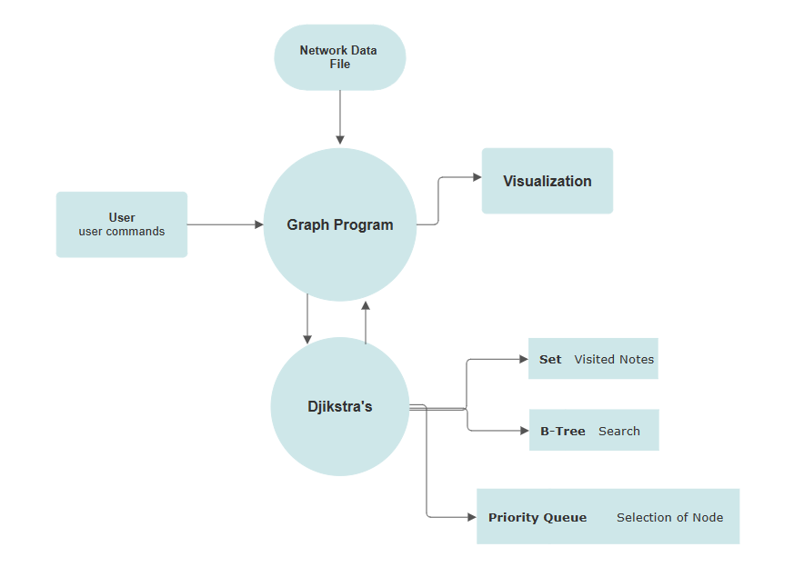

# Network Routing Optimization
*Author: Winston Tsia*

---

## Objective

This project aims to model a computer network using graphs, as well as related data structures, to serve as both a learning tool and a simplified version of modern networking tools.

### Description
A project that models computer networks with an implementation of a graph. Computers are represented as nodes, with latency/bandwidth as weights for edges. Dijkstra's may be used to find the shortest path between devices on the network. Data structures that can be used include a Priority Queue, and a Set to manage nodes visited. The network may be implemented using an Adjacency Matrix. Importing network topology may be done with data validation using live tools, or creating a test case with dummy data. Similar concepts are utilized in routing tables which direct traffic on the World Wide Web. Serves also as an educational tool to understand the underlying functionality of networks.

## Functionality
Input will be received through a file. This file may be generated externally using a tool. Nodes should correspond to devices, and edges should represent connections between devices.

### Inputs
**Scanner:** A scanner may be used with the primary function of specifying the start and endpoint between two devices on the network. A feature may be for users to customize the metrics used for determining the edge weights (e.g., latency, bandwidth). This flexibility enables users to optimize paths based on specific network requirements.

### Algorithms
**Dijkstra's Algorithm:** Implement Dijkstra's algorithm to find the shortest path between two devices in the network. Consider the edge weights as metrics like latency, bandwidth, or a combination of factors.

### Data Structures
**Sets:** Used to keep track of visited nodes during path calculation.  
**B-Tree:** for optimizing search operations or managing information associated with devices.  
**Priority Queue for Optimization:** used to optimize the selection of the next node during the shortest path calculation. This enhances the efficiency of Dijkstra's algorithm.

### Outputs
**Visualization:** Implement a visualization component to display the network graph and highlight the computed shortest paths. Visualization aids in understanding the network structure and optimized routes.

## Timeline
Timeline split into units of more or less similar time:

- **Unit 1:** Research and planning, organizing classes and implementing basic functionality
- **Unit 2:** Implementing Greedy or Dynamic Algorithm
- **Unit 3:** Integrating Additional Data Structures
- **Unit 4:** Presentation and Testing

## Evaluation and Testing
### Evaluation
Success will be determined by the ability for test data to be stored, analyzed, and correctly give intended results.

### Testing Strategies
Testing strategies may include the visualization as confirmation as well as cycle validation. Performance may also be measured and checking correctness of shortest paths.
