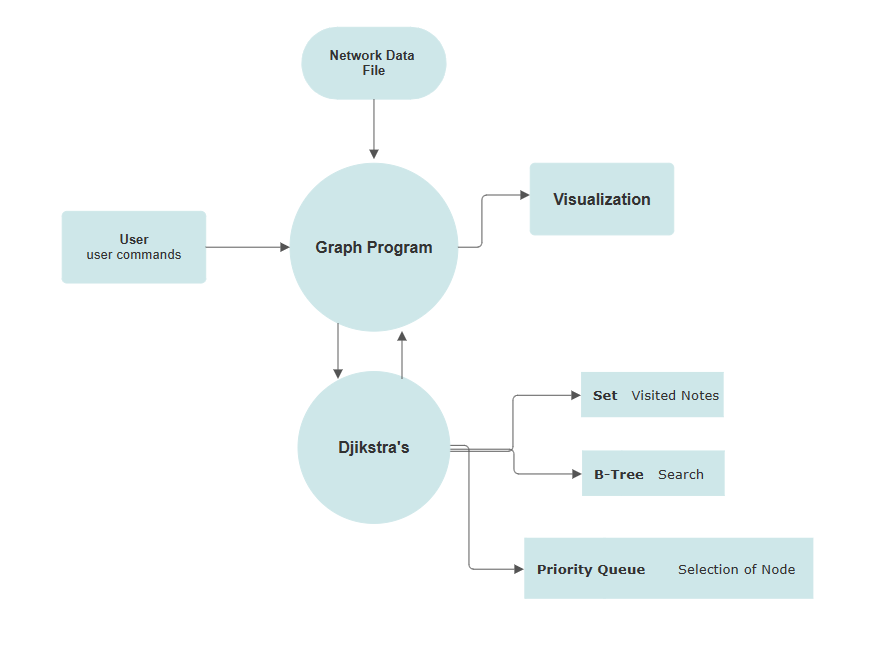

# Network Routing Optimization
*Author: Winston Tsia*

## Setup
clone files:
```
gh repo clone wtsia/network-graph
```
Open the directory with your favorite IDE, or compile the respective files:
```
javac NetworkOptimizer.java
javac Graph.java
javac BTree.java
javac BTreeNode.java
javac Graph.java
```
Run the java code:
```
java NetworkOptimizer
```

## Objective
This project aims to model a computer network using graphs, as well as related data structures, to serve as both a learning tool and a simplified version of modern networking tools.

### Description
A project that models computer networks with an implementation of a graph. Computers are represented as nodes, with latency/bandwidth as weights for edges. Dijkstra's may be used to find the shortest path between devices on the network. Data structures that can be used include a Priority Queue, and a Set to manage nodes visited. The network may be implemented using an Adjacency Matrix. Importing network topology may be done with data validation using live tools, or creating a test case with dummy data. Similar concepts are utilized in routing tables which direct traffic on the World Wide Web. Serves also as an educational tool to understand the underlying functionality of networks.

### Algorithms

**Dijkstra's Algorithm:** Implement Dijkstra's algorithm to find the shortest path between two devices in the network. Consider the edge weights as metrics like latency, bandwidth, or a combination of factors.

### Data Structures
**Sets:** Used to keep track of visited nodes during path calculation.

**B-Tree:** for optimizing search operations or managing information associated with devices.

**Priority Queue for Optimization:** used to optimize the selection of the next node during the shortest path calculation. This enhances the efficiency of Dijkstra's algorithm.

## **Flow:**

